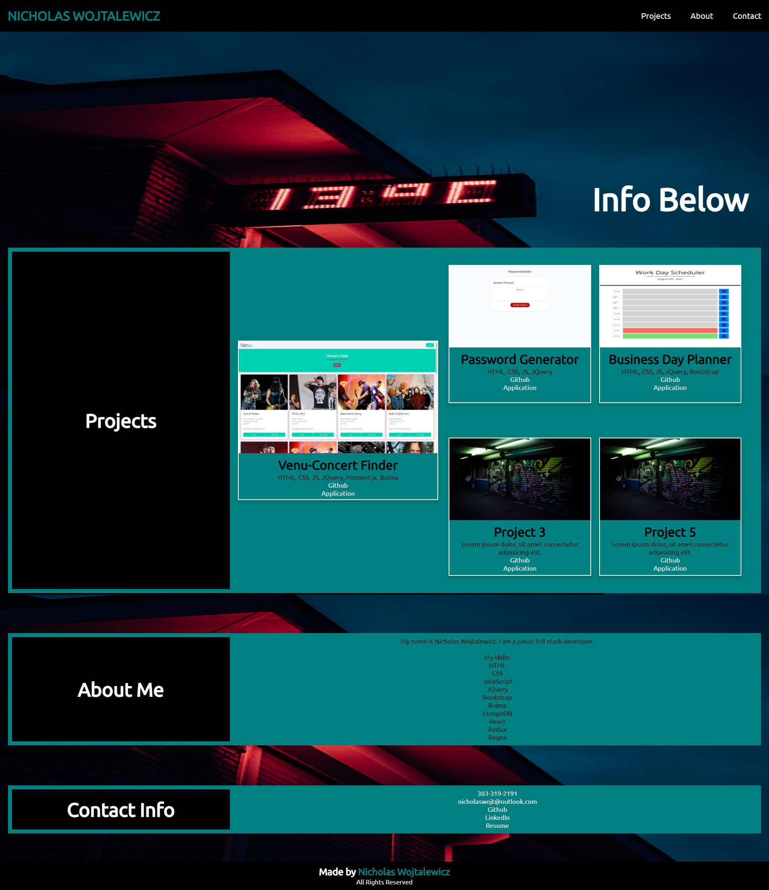

# Professional Portfolio

In this project I used VSCode to code an index.html file styled with a reset.css that negates all browser forced default CSS and also style.css with my own styles. I organized these files in a directory with an assets folder containing my css folder and images folder. Some key styles I used in this project are flexbox, media queries, and variables. I created a Github repository using this directory and created a readme.md. I also took the project live on Github pages. 

Check it out here: https://nickwojt.github.io/portfolio-cbc/

